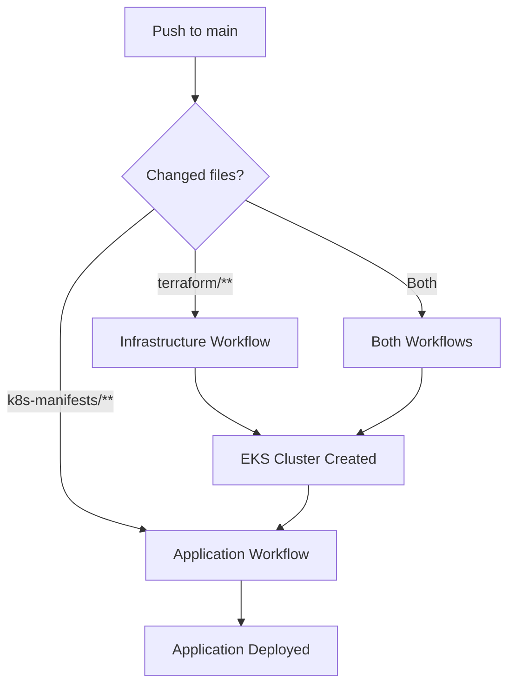

# GitHub Actions Workflows

This project uses **separate workflows** for infrastructure and application deployment, providing better control and flexibility.

## 📁 Workflow Files

### 1. 🏗️ Infrastructure Deployment (`deploy-infrastructure.yml`)
**Purpose:** Manages AWS infrastructure using Terraform

**Triggers:**
- 🔀 **Pull Request** to `main` with changes to `terraform/**`
  - Runs `terraform plan` and comments the plan on PR
  - Validates Terraform formatting and configuration
  
- ✅ **Push** to `main` with changes to `terraform/**`
  - Runs `terraform apply` to deploy infrastructure
  - Generates and commits `grading.json`
  
- 🔘 **Manual Trigger** (`workflow_dispatch`)
  - Deploy infrastructure on-demand from Actions tab

**What it deploys:**
- ✅ EKS Cluster with managed node group
- ✅ VPC with subnets and NAT gateway
- ✅ S3 buckets (state + assets)
- ✅ Lambda function
- ✅ IAM roles and policies
- ✅ CloudWatch logging
- ✅ DynamoDB table for state locking

**Outputs:**
- Terraform outputs displayed in workflow logs

---

### 2. 🚀 Application Deployment (`deploy-application.yml`)
**Purpose:** Deploys Kubernetes applications to EKS cluster

**Triggers:**
- 🔀 **Push** to `main` with changes to `k8s-manifests/**`
  
- 🔘 **Manual Trigger** (`workflow_dispatch`)
  - Deploy application on-demand
  - Choose environment: production/staging/development

**What it deploys:**
- ✅ Retail Store UI application
- ✅ Kubernetes namespace
- ✅ LoadBalancer service for external access
- ✅ Health checks and validation

**Features:**
- Verifies EKS cluster exists before deployment
- Waits for pods to be ready
- Displays LoadBalancer URL
- Runs health checks after deployment

---

## 🎯 Usage Guide

### First-Time Deployment

**Step 1: Deploy Infrastructure**
```bash
# Make infrastructure changes
git add terraform/
git commit -m "feat: initial infrastructure setup"
git push origin main
```

This triggers the **Infrastructure Deployment** workflow, which takes ~20-25 minutes.

**Step 2: Deploy Application** (after infrastructure is ready)
```bash
# Make application changes
git add k8s-manifests/
git commit -m "feat: deploy retail store app"
git push origin main
```

Or manually trigger from GitHub Actions tab:
1. Go to **Actions** → **Deploy Application (Kubernetes)**
2. Click **Run workflow**
3. Select environment and click **Run workflow**

---

### Subsequent Deployments

**Infrastructure Changes Only:**
```bash
# Modify Terraform files
vim terraform/variables.tf
git add terraform/
git commit -m "feat: scale up node group"
git push origin main
```
→ Only infrastructure workflow runs

**Application Changes Only:**
```bash
# Modify K8s manifests
vim k8s-manifests/retail-app/deployment.yaml
git add k8s-manifests/
git commit -m "feat: update app to v2"
git push origin main
```
→ Only application workflow runs

**Both Infrastructure and Application:**
```bash
git add terraform/ k8s-manifests/
git commit -m "feat: update infrastructure and application"
git push origin main
```
→ Both workflows run (infrastructure first, then application)

---

## 🔄 Workflow Dependencies



**Note:** Application workflow checks if EKS cluster exists. If not, it fails with a helpful error message.

---

## 📊 Monitoring Workflows

### View Running Workflows
1. Go to your repository on GitHub
2. Click **Actions** tab
3. See all workflow runs

### View Specific Workflow
- **Infrastructure:** Click "Deploy Infrastructure (Terraform)"
- **Application:** Click "Deploy Application (Kubernetes)"

### Check Logs
- Click on any workflow run
- Expand job steps to see detailed logs
- Look for ✅ (success) or ❌ (failure) indicators

---

## 🔒 Required GitHub Secrets

Both workflows require these secrets:

| Secret Name | Description | Example |
|-------------|-------------|---------|
| `AWS_ACCESS_KEY_ID` | AWS access key for `github` IAM user | `AKIA...` |
| `AWS_SECRET_ACCESS_KEY` | AWS secret key for `github` IAM user | `wJalrXUtn...` |
| `AWS_REGION` | AWS region for deployment | `us-east-1` |

**To add secrets:**
1. Go to **Settings** → **Secrets and variables** → **Actions**
2. Click **New repository secret**
3. Add each secret

---

## ⚙️ Workflow Environment Variables

The workflows use environment variables for configuration. These are defined at the top of each workflow file:

### Infrastructure Workflow
```yaml
env:
  TF_VERSION: '1.6.0'              # Terraform version
  TERRAFORM_DIR: './terraform'      # Terraform files directory
  STATE_BUCKET: 'bedrock-terraform-state-bucket'  # S3 bucket for Terraform state
  LOCK_TABLE: 'bedrock-terraform-state-lock'      # DynamoDB table for state locking
  CLUSTER_NAME: 'project-bedrock-cluster'         # EKS cluster name
```

### Application Workflow
```yaml
env:
  CLUSTER_NAME: 'project-bedrock-cluster'  # EKS cluster name (must match infrastructure)
  APP_NAMESPACE: 'retail-app'              # Kubernetes namespace for the application
```

**To customize:** Edit the workflow files and update these values as needed.

---

## 🎨 Workflow Customization

### Change Infrastructure Only on Specific Branches
Edit `deploy-infrastructure.yml`:
```yaml
on:
  push:
    branches:
      - main
      - staging  # Add more branches
```

### Add Environment-Specific Deployments
Edit `deploy-application.yml`:
```yaml
workflow_dispatch:
  inputs:
    environment:
      options:
        - production
        - staging
        - development
        - qa  # Add more environments
```

### Schedule Regular Deployments
Add to either workflow:
```yaml
on:
  schedule:
    - cron: '0 2 * * 1'  # Every Monday at 2 AM UTC
```

---

## 🐛 Troubleshooting

### Infrastructure Workflow Fails

**Error: "Backend initialization failed"**
- **Fix:** Check if S3 bucket and DynamoDB table exist
- Workflow creates them automatically, but check AWS permissions

**Error: "Error creating EKS cluster"**
- **Fix:** Check AWS service quotas (EKS clusters, VPCs, Elastic IPs)
- Verify IAM permissions for `github` user

### Application Workflow Fails

**Error: "EKS cluster does not exist"**
- **Fix:** Run Infrastructure workflow first
- Verify cluster name in workflow matches Terraform output

**Error: "Unable to connect to cluster"**
- **Fix:** Check EKS cluster is in `ACTIVE` state
- Verify AWS credentials have EKS access

**Error: "LoadBalancer timeout"**
- **Fix:** This is normal, LoadBalancer can take 3-5 minutes
- Check AWS Load Balancers in EC2 console

---

## 💡 Best Practices

1. **Use Pull Requests for Infrastructure Changes**
   - Always review Terraform plan before merging
   - Infrastructure changes are critical and irreversible

2. **Test Application Changes in Staging**
   - Use manual workflow trigger with staging environment
   - Validate before deploying to production

3. **Monitor Costs**
   - Infrastructure workflow creates billable resources
   - Use AWS Cost Explorer to track spending
   - Destroy resources when not needed: `terraform destroy`

4. **Keep Secrets Secure**
   - Never commit AWS credentials to repository
   - Rotate access keys regularly
   - Use IAM roles with least privilege

5. **Version Control Everything**
   - All infrastructure as code (Terraform)
   - All application configuration (Kubernetes manifests)
   - Workflow files under version control

---

## 📚 Additional Resources

- [Terraform AWS Provider](https://registry.terraform.io/providers/hashicorp/aws/latest/docs)
- [EKS Best Practices](https://aws.github.io/aws-eks-best-practices/)
- [GitHub Actions Documentation](https://docs.github.com/en/actions)
- [kubectl Cheat Sheet](https://kubernetes.io/docs/reference/kubectl/cheatsheet/)

---

## 🎓 Workflow Summary

| Aspect | Infrastructure | Application |
|--------|---------------|-------------|
| **Tool** | Terraform | kubectl + Helm |
| **Resources** | AWS (EKS, VPC, S3, Lambda) | Kubernetes (Pods, Services) |
| **Frequency** | Infrequent (setup/scaling) | Frequent (updates/releases) |
| **Duration** | 20-25 minutes | 2-5 minutes |
| **Risk** | High (infrastructure changes) | Medium (app updates) |
| **Rollback** | `terraform destroy` | `kubectl rollout undo` |

**Remember:** Infrastructure is the foundation. Always deploy it first! 🏗️ → 🚀
